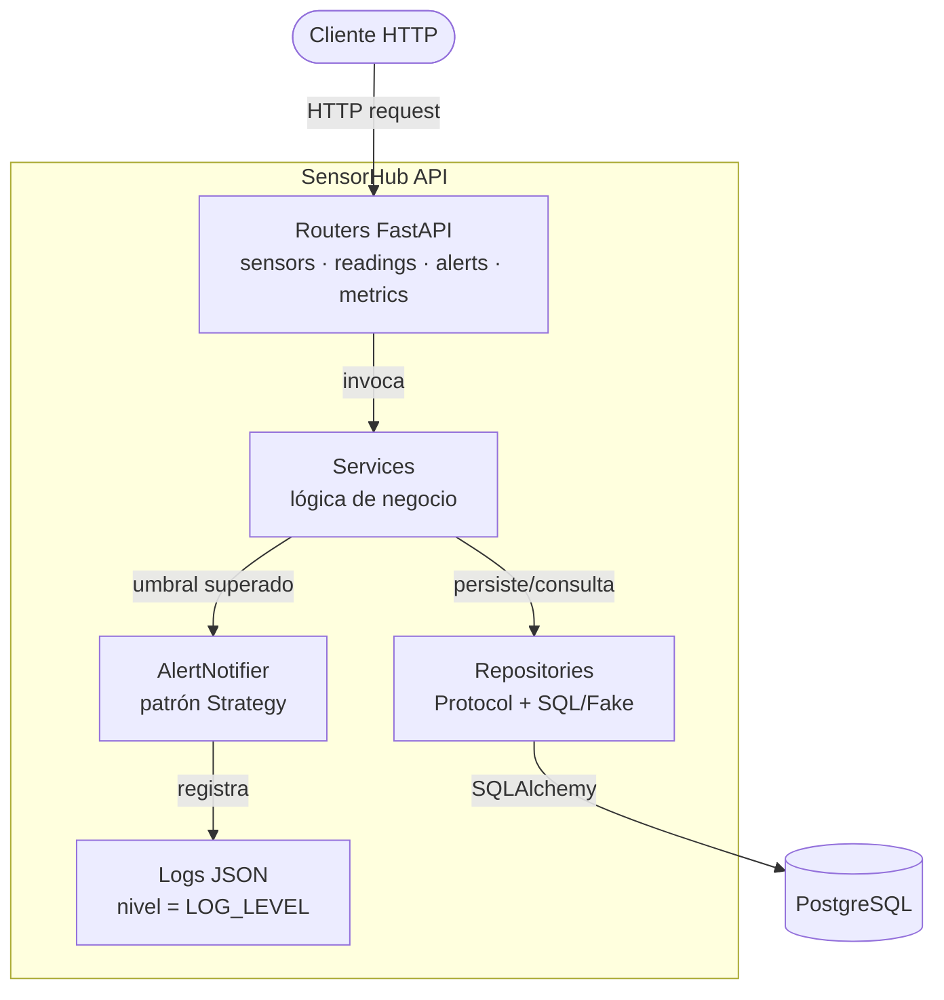

# sdlc-electronica-jose-alejandro-hm

# SensorHub API

API REST para telemetría IoT: gestión de sensores, registro de lecturas,
validación de rangos físicos y alertas automáticas cuando una lectura supera
su umbral configurado.

## 🚀 Estado del Proyecto

| Métrica | Estado |
|---|---|
| **CI/CD** | [](https://github.com/j1390897012-maker/sdlc-electronica-jose-alejandro-hm/actions/workflows/ci.yml) |
| **Despliegue** | [](https://sensorhub-api-mgri.onrender.com) |
| **Cobertura** | ≥ 80% |

## 🌐 API en Producción

- **URL base:** https://sensorhub-api-mgri.onrender.com
- **Healthcheck:** https://sensorhub-api-mgri.onrender.com/health
- **Documentación (Swagger):** https://sensorhub-api-mgri.onrender.com/docs

## 📦 Requisitos

- Python 3.12+
- Docker y Docker Compose
- Git

## 🛠️ Instalación y Ejecución Local

### Opción 1: Con Docker Compose (recomendado)

```bash
# Clonar el repositorio
git clone https://github.com/j1390897012-maker/sdlc-electronica-jose-alejandro-hm.git
cd sdlc-electronica-jose-alejandro-hm

# Levantar API + PostgreSQL
docker-compose up --build
```

La API queda disponible en `http://localhost:8000` y el healthcheck en
`http://localhost:8000/health`.

### Opción 2: Entorno local con SQLite

```bash
# Crear y activar entorno virtual
python -m venv venv
source venv/bin/activate  # En Windows: venv\Scripts\activate

# Instalar dependencias
pip install -r requirements.txt -r requirements-dev.txt

# Aplicar migraciones
alembic upgrade head

# Levantar el servidor de desarrollo
uvicorn app.main:app --reload
```

Sin `DATABASE_URL` configurada, la app usa SQLite (`sensorhub.db`) por
defecto.

## ⚙️ Configuración

Toda la configuración se realiza exclusivamente por variables de entorno
(ver `env.example`):

| Variable | Descripción | Valor por defecto |
|---|---|---|
| `DATABASE_URL` | Cadena de conexión a la base de datos | `sqlite:///sensorhub.db` |
| `POSTGRES_USER` | Usuario de PostgreSQL (Docker Compose) | `sensor` |
| `POSTGRES_PASSWORD` | Contraseña de PostgreSQL (Docker Compose) | — |
| `POSTGRES_DB` | Nombre de la base de datos (Docker Compose) | `sensorhub` |
| `LOG_LEVEL` | Nivel de logging (`DEBUG`, `INFO`, `WARNING`, `ERROR`, `CRITICAL`) | `INFO` |

## 🧱 Arquitectura

El código de `app/` está organizado en capas, con dependencias apuntando
siempre hacia adentro (routers → services → repositories), siguiendo el
principio de inversión de dependencias (DIP) vía `Protocol`. El detalle y
las razones de esta decisión están documentados en
[`docs/adr/0001-arquitectura-en-capas.md`](docs/adr/0001-arquitectura-en-capas.md).



- **Routers** (`app/routers/`): traducen HTTP ↔ servicios; no contienen
  lógica de negocio.
- **Services** (`app/services/`): reglas de negocio (validación de
  sensores/lecturas, umbrales de alerta).
- **Repositories** (`app/repositories/`): acceso a datos vía `Protocol`,
  con implementación real (`SQL*Repository`) y de prueba (`Fake*Repository`).
- **AlertNotifier** (`app/services/alert_notifier.py`): notifica alertas
  mediante logging estructurado, desacoplado del resto del dominio.

## 📚 Endpoints principales

| Método | Ruta | Descripción |
|---|---|---|
| `GET` | `/health` | Healthcheck de la API |
| `GET` | `/metrics` | Métricas operacionales (sensores, lecturas, alertas) |
| `POST` | `/sensors/` | Crear sensor |
| `GET` | `/sensors/` | Listar sensores |
| `GET` | `/sensors/{sensor_id}` | Obtener un sensor |
| `PATCH` | `/sensors/{sensor_id}` | Actualizar un sensor |
| `DELETE` | `/sensors/{sensor_id}` | Eliminar un sensor |
| `POST` | `/sensors/{sensor_id}/readings` | Registrar lectura |
| `GET` | `/sensors/{sensor_id}/readings` | Listar lecturas de un sensor |
| `GET` | `/sensors/{sensor_id}/readings/stats` | Estadísticas de lecturas |
| `GET` | `/readings/{reading_id}` | Obtener una lectura |
| `PATCH` | `/readings/{reading_id}` | Actualizar una lectura |
| `DELETE` | `/readings/{reading_id}` | Eliminar una lectura |
| `GET` | `/alerts` | Listar alertas |
| `PATCH` | `/alerts/{alert_id}/status` | Actualizar estado de una alerta |

Documentación interactiva completa (Swagger UI) disponible en `/docs`.

## ✅ Pruebas y calidad

```bash
# Tests + cobertura (mínimo 80%)
pytest

# Linter
ruff check app/

# Tipado estático
mypy app/


## 📁 Estructura del proyecto

app/
├── main.py               # Punto de entrada FastAPI
├── db.py                 # Configuración de motor y sesión SQLAlchemy
├── logging_config.py     # Logging estructurado (JSON, RNF-5)
├── constants.py          # Constantes de dominio (unidades válidas)
├── routers/              # Endpoints HTTP (sensors, readings, alerts, metrics)
├── services/              # Lógica de negocio
├── repositories/          # Acceso a datos (Protocol + SQL/Fake)
├── models/                # Modelos ORM (SQLAlchemy)
└── schemas/                # Contratos de entrada/salida (Pydantic)

migrations/                # Migraciones Alembic
tests/                      # Suite de pruebas
docs/adr/                    # Decisiones de arquitectura (ADR)
```

## 🚢 Despliegue

El despliegue en [Render](https://render.com) está definido en
[`render.yaml`](render.yaml) e incluye la base de datos PostgreSQL
gestionada. El contenedor corre migraciones (`alembic upgrade head`) antes
de levantar `uvicorn` (ver [`Dockerfile`](Dockerfile)).