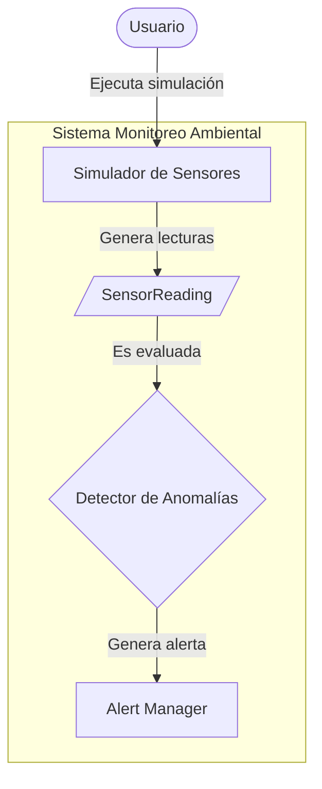

# Diagrama de Arquitectura (Nivel 2)

```mermaid
flowchart TD
    U([Usuario])

    subgraph SIST["Sistema Monitoreo Ambiental"]
        direction TB
        S[Simulador de Sensores]
        R[/SensorReading/]
        D{Detector de Anomalías}
        A[Alert Manager]
    end

    U -->|Ejecuta simulación| S
    S -->|Genera lecturas| R
    R -->|Es evaluada| D
    D -->|Genera alerta| A
```